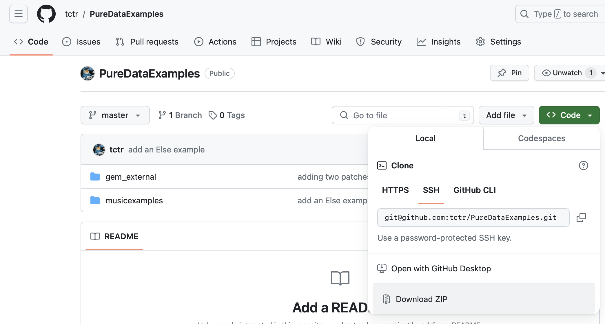

## These are a few Pd (puredata) patches to get a feeling of how the Pd langage works and what you can do with it

## [Pd official site ](https://puredata.info)

## To download the patches :
- ### go to code and download the zip file as showed here :
  

- ### or use the following git command in a terminal : 
```
git clone https://github.com/tctr/PureDataExamples.git
```